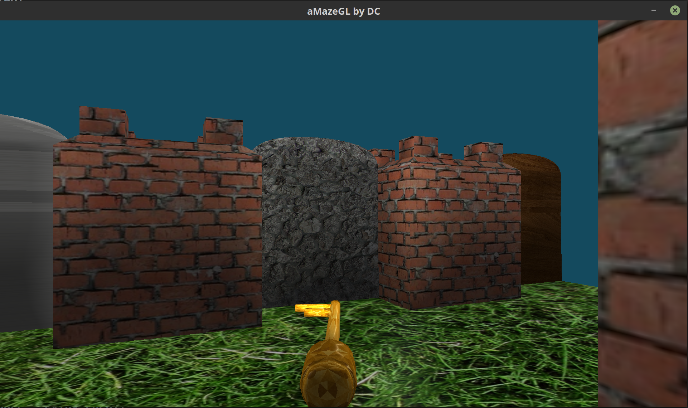

# a-maze-gl
Computer Graphics Project #4 Realtime OpenGL Maze Game

A simple yet pretty-looking interactive 3D first-person Maze Game built using OpenGL.

## MAP FORMAT
The map stores the world as a `rectilinear` map. The first row is `width` and
`height`. The player will begin at the `start` point marked **S** and must reach the `goal` point marked
**G** to finish the level. The player’s progress may be hindered by `walls` (marked **W**) and
`doors` (marked with a capital letter **A-E**). Throughout the environment will be `keys`
(marked with a lowercase **a-e**). A player may not cross through a door unless they
have picked up the corresponding key. A player may never cross a wall.
  

No Doors | Door w/ Key
---| ---
5 5 0000G WW0W0 0W0W0 0W0WW S0000 | 5 5 0000G WW0W0 0WAW0 0W0WW S000a

## BASIC FEATURES
* `Walls & Doors`: Each map element type has a unique rendering. Walls look different than doors,
and each of the five doors and keys look different than each other.
* `Keys`: Each key is rendered as a physical object (key model). Whenever a player moves,
the key is rendered in front of them moving with the character.
* `User Input`: Users are able to move around the map with keyboard input.
Rotate with the **left** and **right** keys, and move forward and back with the **up** and **down** keys.
* `Collision Detection`: Users are not able to move through walls or locked
doors.
* `Lighting`: Ambient and diffuse lighting.

## ADVANCED FEATURES - EXTRA CREDIT
* Multiple point lights and directional light.
* Textured walls, floor, door, keys and goal.
* Used self composed models to represent keys, doors, walls, floor with [Wings3D](http://www.wings3d.com).
* Model loading in the [OBJ 3D models format](http://enwp.org/Wavefront_.obj_file). Supports v, vt, vn, f tags.
* Enter key can be used to pick up a key or switch the key held by you.
* The held key is always rendered pointing away from the user for a true first-person experience.
* Holding Shift key while moving or turning, does it faster.

## GAMEPLAY SNAPSHOT

## GAMEPLAY VIDEO
